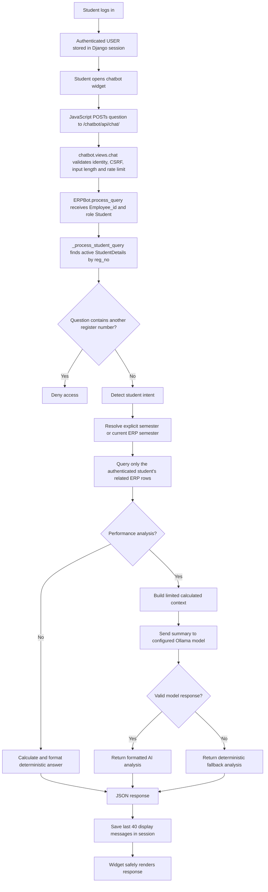
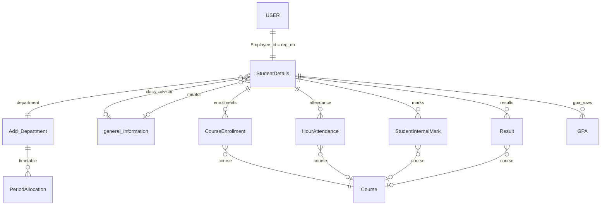

# Student Chatbot Data Flow

This document explains how the ERP student chatbot identifies a logged-in student, retrieves that student's permitted ERP data, and returns an answer.

## The most important point

The AI model does **not** search the ERP database.

Django code performs authentication, intent detection, semester selection, permission enforcement, database queries, calculations, and data formatting. Most student answers are returned directly from those deterministic operations without calling an AI model.

The Ollama model is currently used only for the student **performance analysis** response. Even in that case, Django retrieves and calculates the data first and gives the model a limited summary. The model has no database connection and cannot select a different student.

## Main components

| Component | Responsibility |
| --- | --- |
| `templates/chatbot/widget.html` | Supplies the chat and history endpoint URLs to the widget. |
| `static/chatbot/chatbot.js` | Sends the student's question as JSON, displays the response, and loads session history. |
| `chatbot/urls.py` | Maps `/chatbot/api/chat/` and `/chatbot/api/history/` to Django views. |
| `chatbot/views.py` | Validates authentication and input, resolves the role, rate-limits requests, calls `ERPBot`, and stores display history. |
| `chatbot/chatbot_logic.py` | Routes student intents, applies ownership and semester scope, queries ERP models, performs calculations, and formats answers. |
| `chatbot/student_prompts.py` | Defines the restricted system prompt used for AI-assisted student performance analysis. |
| ERP application models | Provide the authoritative profile, course, timetable, attendance, marks, result, and GPA data. |

## End-to-end request flow



## 1. Student login establishes the identity

The login begins in `user_accounts/views/student_auth_views.py` in `student_login()`.

1. The submitted login ID and password are passed to Django's `authenticate()`.
2. `EmployeeIDBackend` in `user_accounts/auth.py` looks up an active `USER` record in the `rit_approval_system` database.
3. The password hash is checked.
4. The login view permits only a user with `is_student=True` and rejects staff, administrators, non-students, and inactive users.
5. `login(request, user)` stores the authenticated `USER` identity in the Django session.

For a student account, `USER.Employee_id` is expected to contain the student's registration number. This value is the bridge between the authentication database and the academic `StudentDetails` record.

## 2. The browser submits a question

The widget provides these endpoints:

- Chat: `/chatbot/api/chat/`
- History: `/chatbot/api/history/`

`submitQuery()` in `static/chatbot/chatbot.js` sends:

```json
{
  "query": "Show my attendance in Semester 4"
}
```

The request includes:

- the existing Django session cookie through `credentials: "same-origin"`;
- a CSRF token in the `X-CSRFToken` header;
- an `Accept: application/json` header.

The browser does not send a student ID separately. The server derives the student identity from the authenticated session.

## 3. The API authenticates and validates the request

`chat()` in `chatbot/views.py` calls `_chat_identity(request)`.

For a student, the identity function requires:

- an authenticated `request.user`;
- a non-empty `request.user.Employee_id`;
- `request.user.is_student=True`;
- the account not to be a parent account.

It returns:

```text
(Employee_id, "Student")
```

The API then:

1. accepts only `POST`;
2. parses JSON safely;
3. requires a non-empty text query;
4. limits the query to 1,200 characters;
5. limits an identity to 30 requests per minute through Django's cache;
6. calls `ERPBot.process_query()` with the authenticated ID and role;
7. catches unexpected errors without exposing an internal stack trace to the browser.

## 4. The student router creates a strict ownership boundary

`ERPBot.process_query()` checks the active role before any academic query. When the role is `Student`, it immediately routes to `_process_student_query()` and never enters the faculty, Class Advisor, HOD, or administrator data paths.

`_process_student_query()` loads the profile with the equivalent of:

```python
StudentDetails.objects.filter(
    reg_no=authenticated_employee_id,
    is_active=True,
    is_discontinued=False,
).first()
```

The reusable `_student_queryset()` also:

- uses `select_related("department", "ca", "mentor")`;
- selects only the profile columns needed by the chatbot;
- avoids unnecessary relationship queries.

After the profile is loaded, every student handler receives this exact `student` object. ORM filters use `student=student` or the profile's own department, semester, and section.

### Cross-student protection

Before intent routing, the code extracts any 10-to-15-digit registration-like number from the question. If any number differs from the authenticated student's `reg_no`, the request is rejected with:

```text
Student accounts can access only their own academic information.
```

This means changing text in the browser, editing JavaScript, or manually calling the endpoint does not grant access to another student.

## 5. Intent detection

The student router uses ordered phrase and keyword checks. It does not ask the model to decide which database query to run.

| Student request | Handler or logic | Primary ERP models |
| --- | --- | --- |
| Greeting or help | `_process_student_query()` | `StudentDetails` |
| Timetable or today's classes | `_handle_student_timetable()` | `PeriodAllocation`, `Course` |
| Profile, department, batch, advisor, or mentor | `_process_student_query()` | `StudentDetails`, department, CA and mentor relationships |
| Academic overview or semester summary | `_handle_student_academic_overview()` | `CourseEnrollment`, `HourAttendance`, `StudentInternalMark`, `GPA` |
| Performance analysis | `_handle_student_performance_insights()` | The same academic models, followed by optional Ollama analysis |
| Attendance or attendance shortage | `_handle_student_attendance()` | `HourAttendance`, `CourseEnrollment` |
| Subject or course list | `_get_student_subject_enrollments()` | `CourseEnrollment`, `Course` |
| Internal marks, IAT, model exam, or subject marks | `_handle_student_internal_marks()` | `StudentInternalMark`, `Course` |
| Results, grades, GPA, or CGPA | `_handle_student_results()` | `Result`, `GPA`, `Course` |

If none of these intents match, the student receives a safe help response. The unmatched student question is not sent to the AI model.

## 6. Semester selection

All semester-specific student handlers reuse `_resolve_student_semester()`.

The rule is:

```text
Explicit semester in question > current semester in StudentDetails
```

Examples:

| Question | Semester used |
| --- | --- |
| `Show my subjects` | `StudentDetails.semester` |
| `Show my attendance this semester` | `StudentDetails.semester` |
| `Show Semester 4 subjects` | Semester 4 |
| `Analyze my performance in 3rd semester` | Semester 3 |

The parser recognizes forms such as `semester 4`, `sem 4`, and `4th semester`. If there is no explicit semester and the profile has no current semester, the chatbot asks the student to contact the department office instead of guessing.

## 7. How each data query works

### Profile

The profile answer comes from the already-authorized `StudentDetails` instance and its selected relationships:

- name and registration number;
- department;
- batch, year, semester, and section;
- email and mobile number;
- Class Advisor name/email;
- mentor name/email.

No AI call is made.

### Subjects

`_get_student_subject_enrollments()` filters `CourseEnrollment` by:

```python
student=authenticated_student
enroll=True
semester=requested_or_current_semester
```

If several academic years exist for that semester, the latest academic year is selected. The response reads course codes and titles through the `CourseEnrollment.course` relationship and returns distinct rows ordered by course code.

No AI call is made.

### Timetable

`_handle_student_timetable()` uses the authenticated student's:

- department;
- selected semester;
- section.

It filters `PeriodAllocation` using those values. A named weekday is used when supplied; otherwise the current server weekday is used unless the student explicitly asks for a weekly timetable.

The period fields contain course codes. A second ORM query maps those codes to titles from `Course`.

No AI call is made. The system currently has period order but no bell-time mapping, so it cannot calculate the exact clock time of the next class.

### Attendance

`_student_hour_attendance_rows()` filters `HourAttendance` by the authenticated student and semester, then normally by the academic year selected from enrollments.

Django aggregates each subject with:

- `total`: number of attendance rows;
- `attended`: rows whose status is `Present` or `On Duty`;
- `absent`: rows whose status is `Absent`.

The percentage is calculated in Python:

```text
attended / total * 100
```

Overall attendance is weighted correctly:

```text
sum(attended classes) / sum(conducted classes) * 100
```

`_attendance_projection()` calculates either:

- how many consecutive classes must be attended to reach 75%; or
- how many additional absences are possible before falling below 75%.

A subject code in the question applies an additional filter. `below 75` and `shortage` show only low-attendance subjects.

No AI call is made.

### Internal marks

`_get_student_internal_mark_rows()` filters `StudentInternalMark` by:

- authenticated student;
- selected semester;
- selected academic year when available;
- subject code when explicitly supplied.

Marks are stored at question/sub-question level. `_aggregate_student_mark_details()` groups them by course and assessment. For OR-choice questions, it counts only one option path by using the highest option maximum and obtained value instead of adding every alternative.

The query can additionally restrict results to a named assessment such as `IAT 1`, `IAT 2`, or `Model Exam`.

No AI call is made. The displayed maximum is calculated from the recorded question-level `max_marks`; the model does not invent or normalize it.

### Published results and GPA

`_handle_student_results()` filters both `Result` and `GPA` by the authenticated student and selected semester.

It returns published course grades plus GPA/CGPA rows. Missing result data produces a clear `No published ... results` response rather than an estimated grade.

No AI call is made.

### Academic overview

`_handle_student_academic_overview()` combines deterministic values from:

- subject enrollment count;
- weighted attendance percentage;
- recorded internal-mark percentage;
- latest GPA/CGPA for the selected semester.

No AI call is made.

## 8. How AI-assisted performance analysis works

`_handle_student_performance_insights()` is the student self-service path that calls the configured model.

### Step 1: Django retrieves and calculates the data

Before contacting Ollama, Django:

1. resolves the requested or current semester;
2. finds the relevant academic year from subject enrollment;
3. retrieves the student's internal-mark rows;
4. aggregates assessments into a percentage per subject;
5. ranks subjects and identifies strongest and weakest subjects;
6. calculates the recorded subject average;
7. retrieves subject attendance percentages;
8. retrieves the selected semester's latest GPA/CGPA;
9. prepares a complete deterministic fallback response.

If there are no recorded internal marks, the model is not called.

### Step 2: A limited summary is sent to the model

The model receives a text summary containing:

- authenticated student's name;
- ERP department;
- selected semester;
- academic year;
- calculated subject average;
- selected-semester GPA/CGPA if recorded;
- course title/code and calculated percentage;
- course title/code and calculated attendance percentage.

It does **not** receive:

- database credentials;
- Django model objects or QuerySets;
- SQL access;
- another student's records;
- the full ERP database;
- unpublished values that were not returned by the ORM queries.

### Step 3: Ollama generates coaching text

`_ai_client()` uses the OpenAI-compatible client with:

- `OLLAMA_BASE_URL`;
- `OLLAMA_MODEL`;
- `OLLAMA_TIMEOUT`;
- `OLLAMA_MAX_TOKENS`.

The current settings point to an Ollama-compatible server. `STUDENT_PERFORMANCE_SYSTEM_PROMPT` instructs the model to:

- use only the supplied student's selected-semester data;
- avoid inventing facts or values;
- identify evidence-based strengths and weak areas;
- suggest practical study actions and department-related projects;
- encourage balanced extracurricular development;
- return a fixed set of sections.

### Step 4: The model output is validated

The chatbot removes hidden `<think>` content and requires every expected heading. If the model is unreachable, times out, returns empty text, or omits required sections, its response is discarded and the precomputed deterministic fallback is returned.

Therefore, an AI connection failure should not remove access to recorded performance data in this handler.

## 9. Response and conversation history

After `ERPBot` returns text, `chatbot.views.chat()` stores two entries in the Django session:

- the student's question;
- the assistant's response.

Only the most recent 40 messages are retained under `erp_chat_history`. `GET /chatbot/api/history/` returns them and `DELETE /chatbot/api/history/` clears them.

This history is primarily display history. The student performance request does not send the previous conversation to Ollama, so a previous message is not silently used to change the database scope.

The JavaScript renderer creates text nodes and supports a restricted `**bold**` format. It does not insert arbitrary model HTML into the page.

## 10. ERP models and relationships used



The main model definitions are:

- `USER`: `user_accounts/models.py`
- `StudentDetails`: `user_accounts/models.py`
- `Course`, `CourseEnrollment`, `PeriodAllocation`: `course_management/models.py`
- `HourAttendance`: `student_management/models.py`
- `StudentInternalMark`, `Result`, `GPA`: `examination_management/models.py`

## 11. Detailed examples

### Example A: `Show my attendance in Semester 4`

```text
Student session
  -> USER.Employee_id
  -> role Student
  -> StudentDetails.reg_no exact match
  -> explicit semester parser returns 4
  -> latest Semester 4 CourseEnrollment academic year
  -> HourAttendance filtered by student + semester + academic year
  -> ORM Count/conditional Count per subject
  -> weighted overall percentage and 75% projection
  -> formatted response
  -> JSON
  -> session history
  -> chatbot bubble
```

Ollama is not involved.

### Example B: `Analyze my performance in Semester 4`

```text
Student session
  -> exact StudentDetails match
  -> explicit semester parser returns 4
  -> relevant enrollment academic year
  -> StudentInternalMark question rows
  -> deterministic assessment and subject percentages
  -> HourAttendance percentages + GPA/CGPA
  -> limited summary sent to Ollama
  -> validate required headings
  -> valid AI coaching response OR deterministic fallback
```

The model explains supplied figures; it does not retrieve them.

## 12. Security controls

Current controls include:

- session-based authentication;
- student-only route separation;
- exact `Employee_id` to `StudentDetails.reg_no` mapping;
- active and non-discontinued student checks;
- rejection of another registration number in the question;
- ORM queries scoped to the authenticated `student` object;
- no raw SQL constructed from chat text;
- CSRF protection;
- 1,200-character input limit;
- 30-request-per-minute rate limit;
- safe error messages;
- output rendering through text nodes rather than arbitrary HTML;
- fixed-format validation of the AI performance response;
- deterministic fallback when the model fails.

### Privacy implication

Performance analysis sends the limited summary described above to the server configured by `OLLAMA_BASE_URL`. It is currently intended for Ollama. If that URL is changed to an external service, the supplied name and academic summary would be transmitted to that service and must be covered by the institution's privacy policy.

## 13. Important operational behavior and limitations

1. **Authentication mapping must match:** `USER.Employee_id` must equal `StudentDetails.reg_no`. A mismatch causes the profile-mapping authentication error.
2. **ERP data remains authoritative:** missing subjects, attendance, marks, or results are reported as missing; the model is not allowed to fill them in.
3. **Academic-year fallback:** attendance and internal-mark helpers first use the latest enrollment academic year. If that exact year has no rows, they fall back to student-and-semester rows. This preserves legacy data access but may combine older academic-year data when ERP mappings are incomplete.
4. **Timetable clock times are unavailable:** `PeriodAllocation` stores period order but not bell times.
5. **History is session-based:** clearing the session, logging out, or session expiry can remove visible history. It is not a permanent conversation database.
6. **Natural-language routing is keyword-based:** supported variations must match the implemented intent phrases or semester patterns.
7. **AI is explanatory, not authoritative:** marks, attendance, subjects, GPA, and identity always come from ORM results, not generated text.

### Authentication review findings

These findings are outside `chatbot_logic.py` and were not changed while creating this document:

1. `student_login()` currently prints the submitted password and password-debug information to server output. Those debug statements should be removed before production because credentials can enter console or application logs.
2. `EmployeeIDBackend.authenticate()` checks `is_active=True` during login, but `EmployeeIDBackend.get_user()` restores a session user by primary key without rechecking `is_active`. Consider rechecking the active flag so a deactivated account cannot remain usable through an existing session.

## 14. Troubleshooting checklist

| Symptom | Verify |
| --- | --- |
| `student profile is not mapped` | `USER.Employee_id` exactly matches an active, non-discontinued `StudentDetails.reg_no`. |
| Current-semester answer is wrong | Check `StudentDetails.semester`. Explicit `Semester N` should override it. |
| Subjects are missing | Check active `CourseEnrollment` rows, `enroll=True`, semester, academic year, and course relationship. |
| Attendance is missing | Check `HourAttendance.student`, semester, academic year, course, and status spelling. |
| Marks are missing or totals differ | Check `StudentInternalMark.student`, semester, academic year, course code, exam name, question maximums, and OR-option rows. |
| Results/GPA are missing | Check published `Result` and `GPA` rows for that student and semester. |
| Timetable is missing | Check the student's department/section/semester and matching `PeriodAllocation`. |
| Performance uses fallback text | Check Ollama availability, model name, timeout, and whether the model returned all required headings. |
| Chat history is missing | Check the Django session and `erp_chat_history`; history is capped at 40 messages. |

## 15. Source reference map

Line numbers below describe the current implementation and may move as the file changes.

| Area | Current source |
| --- | --- |
| Student login | `user_accounts/views/student_auth_views.py:306` |
| Authentication backend | `user_accounts/auth.py:5` |
| HTTP identity resolution | `chatbot/views.py:22` |
| Chat endpoint | `chatbot/views.py:133` |
| Session history endpoint | `chatbot/views.py:189` |
| Main chatbot entry point | `chatbot/chatbot_logic.py:504` |
| Student self-service router | `chatbot/chatbot_logic.py:783` |
| Semester resolver | `chatbot/chatbot_logic.py:943` |
| Subject enrollment query | `chatbot/chatbot_logic.py:976` |
| Internal mark query/aggregation | `chatbot/chatbot_logic.py:1011` and `:1058` |
| Student marks response | `chatbot/chatbot_logic.py:1124` |
| Result/GPA response | `chatbot/chatbot_logic.py:1189` |
| Timetable response | `chatbot/chatbot_logic.py:1245` |
| Attendance query and response | `chatbot/chatbot_logic.py:1320` and `:1366` |
| Academic overview | `chatbot/chatbot_logic.py:1464` |
| AI-assisted performance analysis | `chatbot/chatbot_logic.py:1505` |
| Student performance prompt | `chatbot/student_prompts.py:1` |
| Ollama settings | `rit_academic_system/settings.py:312` |
